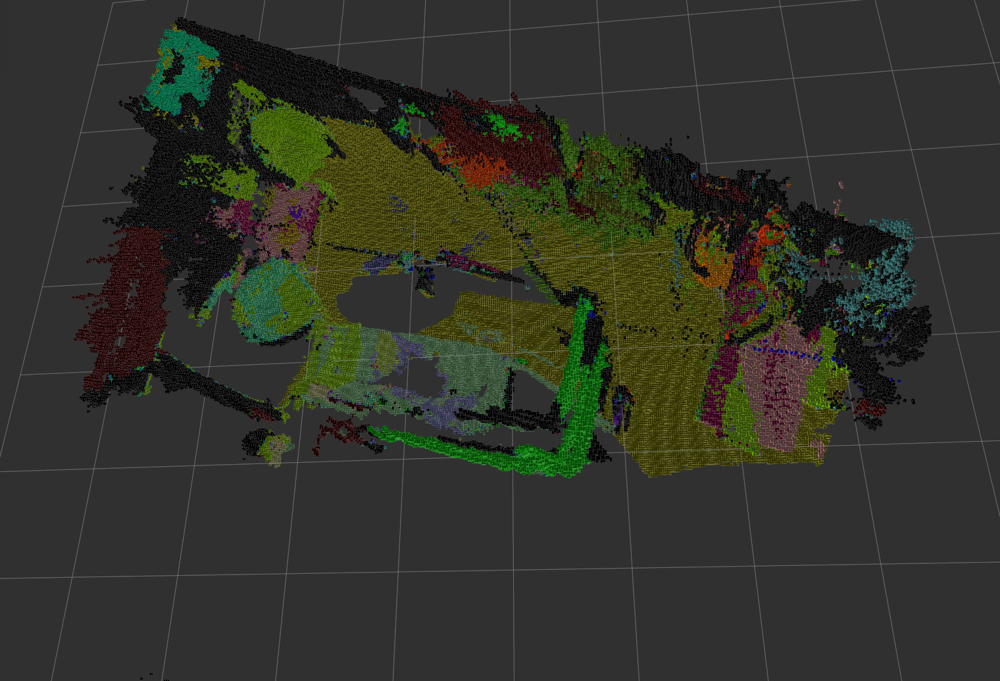
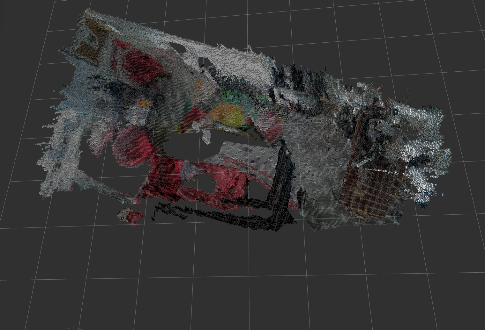
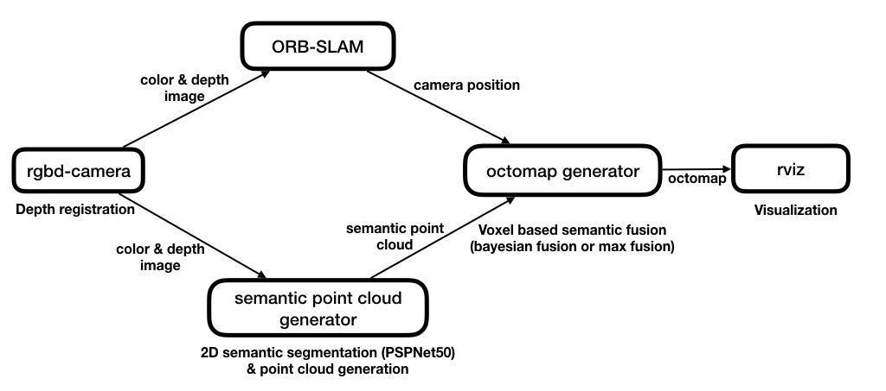

# Semantic SLAM
***Author:*** Xuan Zhang, ***Supervisor:*** David Filliat

Research internship @ENSTA ParisTech

Semantic SLAM can generate a 3D voxel based semantic map using only a hand held RGB-D camera (e.g. Asus xtion) in real time. We use ORB_SLAM2 as SLAM backend, a CNN (PSPNet) to produce semantic prediction and fuse semantic information into a octomap. Note that our system can also be configured to generate rgb octomap without semantic information.

Semantic octomap             |  RGB octomap
:-------------------------:|:-------------------------:
  | 


### Project Report & Demo:

- Demo: [[Youtube](https://youtu.be/IwQaRnFmRuU)] [[Youku](http://player.youku.com/embed/XMzc5NTI0OTcyNA==)]
- Project report: [[Google](https://drive.google.com/open?id=1Uk5YLMyoyMGMkE8FtJCNrZp_brGh5z3M)] [[Baidu](https://pan.baidu.com/s/1i67xQAZhqVNJayeg5gmegA)]

### Acknowledgement

This work cannot be done without many open source projets. Special thanks to

- [ORB_SLAM2](https://github.com/raulmur/ORB_SLAM2), used as our SLAM backend.
- [pytorch-semseg](https://github.com/meetshah1995/pytorch-semseg), used as our semantic segmantation library.
- [octomap](https://github.com/OctoMap/octomap), used as our map representation.
- [pcl library](http://pointclouds.org/), used for point cloud processing.

# License

This project is released under a [GPLv3 license](./LICENSE.txt).

# Overview



# Dependencies

- Openni2_launch

```sh
sudo apt-get install ros-kinetic-openni2-launch
```

- ORB_SLAM2

We use [ORB_SLAM2](https://github.com/raulmur/ORB_SLAM2) as SLAM backend. Please refer to the official repo for installation dependencies.

- PyTorch 0.4.0

- For other dependencies, please see [semantic_slam/package.xml](./semantic_slam/package.xml)

# Installation

### Build ORB_SLAM2

After installing dependencies for ORB_SLAM. You should first build the library.

```sh
cd ORB_SLAM2
./build.sh
```

### Install dependencies

```sh
rosdep install semantic_slam
```

### Make

```sh
cd <your_catkin_work_space>
catkin_make
```

# Run with camera

### Launch rgbd camera

```sh
roslaunch semantic_slam camera.launch
```

### Run ORB_SLAM2 node

```sh
roslaunch semantic_slam slam.launch
```

When the slam system has finished initialization, try to move the camera and check if the camera trajectory in the viewer is reasonable, reset SLAM if not.

### Run semantic_mapping

You can now run the semantic_cloud node and the octomap_generator node. You will have to provide trained models, see links below.

```sh
roslaunch semantic_slam semantic_mapping.launch
```

This will also launch rviz for visualization.

You can then move around the camera and construct semantic map. Make sure SLAM is not losing itself.

If you are constructing a semantic map, you can toggle the display color between semantic color and rgb color by running

```sh
rosservice call toggle_use_semantic_color
```
# Run with ros bag

If you want to test semantic mapping without a camera, you can also run a rosbag.

### Download rosbag with camera position (tracked by SLAM)

[demo.bag](https://drive.google.com/file/d/1j12c_Fruu-ylO1FHYC4sbmlG9IutYJQg/view?usp=sharing)

### Run semantic_mapping

```sh
roslaunch semantic_slam semantic mapping.launch
```
### Play ROS bag

```sh
rosbag play demo.bag
```

# Trained models

- [Model trained on ade20k dataset](https://drive.google.com/file/d/1u_BEWdVIYiDnpVmAxwME1z3rnWWkjxm5/view?usp=sharing)
- [Model fine tuned on SUNRGBD dataset](https://drive.google.com/file/d/1t26t2VHNOzmjH-0lDTdYzXBACOV_4-eL/view?usp=sharing)

# Run time

Evaluation is done on a computer with 6 Xeon 1.7 GHz CPU and one GeForce GTX Titan Z GPU. Input image size is 640×480 recorded by a camera Asus Xtion Pro.

When our system works together, ORB-SLAM works at about 15 Hz (the setting is 30 Hz). Point cloud generation alone can run at 30 Hz. Semantic segmentation runs at about 2 to 3 Hz. Octomap insertion and visualization works at about 1 Hz. Please refer to section 3.6.2 of the project report for more analysis of run times.

# Citation

To cite this project in your research:

```
    @misc{semantic_slam,
      author = {Xuan, Zhang and David, Filliat},
      title = {Real-time voxel based 3D semantic mapping with a hand held RGB-D camera},
      year = {2018},
      publisher = {GitHub},
      journal = {GitHub repository},
      howpublished = {\url{https://github.com/floatlazer/semantic_slam}},
    }
```
# Configuration

You can change parameters for launch. Parameters are in `./semantic_slam/params` folder.

***Note that you can set octomap/tree_type and semantic_cloud/point_type to 0 to generate a map with rgb color without doing semantic segmantation.***

### Parameters for octomap_generator node (octomap_generator.yaml)

namespace octomap

- pointcloud_topic
  - Topic of input point cloud topic
- tree_type
  - OcTree type. 0 for ColorOcTree, 1 for SemanticsOcTree using max fusion (keep the most confident), 2 for SemanticsOcTree using bayesian fusion (fuse top 3 most confident semantic colors). See project report for details of fusion methods.
- world_frame_id
  -  Frame id of world frame.
- resolution
  - Resolution of octomap, in meters.
- max_range
  - Maximum distance of a point from camera to be inserted into octomap, in meters.
- raycast_range
  - Maximum distance of a point from camera be perform raycasting to clear free space, in meters.
- clamping_thres_min
  - Octomap parameter, minimum octree node occupancy during update.   
- clamping_thres_max
  -  Octomap parameter, maximum octree node occupancy during update.
- occupancy_thres
  - Octomap parameter, octree node occupancy to be considered as occupied
- prob_hit
  - Octomap parameter, hitting probability of the sensor model.
- prob_miss
  - Octomap parameter, missing probability of the sensor model.
- save_path
  - Octomap saving path. (not tested)

### Parameters for semantic_cloud node (semantic_cloud.yaml)

namespace camera

- fx, fy, cx, cy
  -  Camera intrinsic matrix parameters.
- width, height
  -  Image size.

namespace semantic_pcl

- color_image_topic
  - Topic for input color image.
- depth_image_topic
  - Topic for input depth image.
- point_type
  - Point cloud type, should be same as octomap/tree_type. 0 for color point cloud, 1 for semantic point cloud including top 3 most confident semanic colors and their confidences, 2 for semantic including most confident semantic color and its confident. See project report for details of point cloud types.
- frame_id
  - Point cloud frame id.
- dataset
  - Dataset on which PSPNet is trained. "ade20k" or "sunrgbd".
- model_path
  - Path to pytorch trained model.
